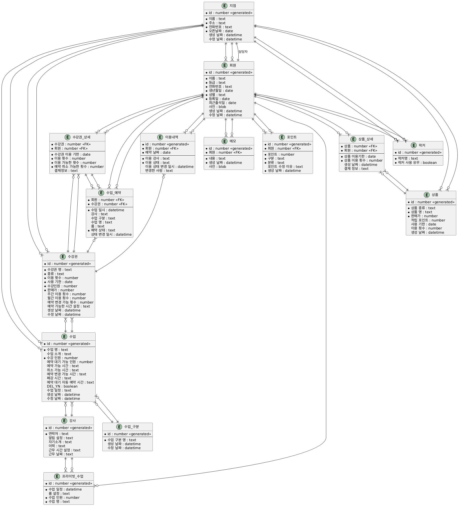

# 피니시골프 ERD

## 테이블 구조

### 지점
| 컬럼 | 설명 |
|------|------|
| [PK] id | 지점 고유 식별자 |
| 이름 | 지점 이름 |
| 주소 | 지점 주소 |
| 전화번호 | 지점 연락처 |
| 지점장 | 지점 담당자 |
| 지점장 전화번호 | 지점 연락처 |
| 오픈날짜 | 지점 오픈일 |
| 생성 날짜 | 레코드 생성 날짜 |
| 수정 날짜 | 레코드 수정 날짜 |

### 회원
| 컬럼 | 설명 |
|------|------|
| [PK] id | 회원 고유 식별자 |
| [FK] 지점 | 지점 ID |
| 이름 | 회원 이름 |
| 등급 | 회원 등급 |
| 전화번호 | 회원 연락처 |
| 생년월일 | 회원 생년월일 |
| 성별 | 회원 성별 |
| 등록일 | 회원 가입일 |
| 최근출석일 | 최근 출석 날짜 |
| 사진 | 회원 프로필 사진 |
| 생성 날짜 | 레코드 생성 날짜 |
| 수정 날짜 | 레코드 수정 날짜 |

### 강사
| 컬럼 | 설명 |
|------|------|
| [PK] id | 강사 고유 식별자 |
| 연락처 | 강사 연락처 |
| 알림 설정 | 알림 설정 정보 |
| 자기소개 | 강사 자기소개 |
| 이력 | 강사 경력 정보 |
| 근무 시간 설정 | 근무 가능 시간 |
| 근무 날짜 | 근무 가능 날짜 |

### 수강권
| 컬럼 | 설명 |
|------|------|
| [PK] id | 수강권 고유 식별자 |
| [FK] 수업 | 연결된 수업 ID |
| [FK] 지점 | 지점 ID |
| 수강권 명 | 수강권 이름 |
| 종류 | 횟수제 또는 기간제 |
| 이용 횟수 | 이용 가능 횟수 |
| 사용 기한 | 수강권 유효 기간 |
| 수강인원 | 최대 수강 가능 인원 |
| 판매가 | 수강권 가격 |
| 주간 이용 횟수 | 주당 이용 가능 횟수 |
| 월간 이용 횟수 | 월당 이용 가능 횟수 |
| 예약 변경 가능 휫수 | 예약 변경 가능 횟수 |
| 예약 가능한 시간 설정 | 예약 가능 시간대 |
| 생성 날짜 | 레코드 생성 날짜 |
| 수정 날짜 | 레코드 수정 날짜 |

### 수강권 상세
| 컬럼 | 설명 |
|------|------|
| [PK] 수강권 | 수강권 ID |
| [PK] 회원 | 회원 ID |
| 수강권 이용 기한 | 개별 회원의 수강권 유효 기간 |
| 이용 횟수 | 개별 회원의 이용 횟수 |
| 이용 가능한 횟수 | 남은 이용 가능 횟수 |
| 예약 취소 가능한 횟수 | 예약 취소 가능 횟수 |
| 결제정보 | 결제 관련 정보 |

### 수업
| 컬럼 | 설명 |
|------|------|
| [PK] id | 수업 고유 식별자 |
| [FK] 강사 | 담당 강사 ID |
| [FK] 지점 | 지점 ID |
| 수업 명 | 수업 이름 |
| 수업 소개 | 수업 설명 |
| 수강 인원 | 최대 수강 인원 |
| 예약 대기 가능 인원 | 대기 가능 인원 수 |
| [FK] 수업 구분 | 수업 구분 ID |
| 예약 가능 시간 | 예약 가능한 시간 |
| 취소 가능 시간 | 취소 가능한 시간 |
| 예약 변경 가능 시간 | 예약 변경 가능한 시간 |
| 폐강 시간 | 폐강 기준 시간 |
| 예약 대기 자동 예약 시간 | 대기열 자동 예약 시간 |
| DEL_YN | 삭제 여부 |
| 수업 일정 | 수업 스케줄 |
| 생성 날짜 | 레코드 생성 날짜 |
| 수정 날짜 | 레코드 수정 날짜 |

### 프라이빗 수업
| 컬럼 | 설명 |
|------|------|
| [PK] id | 프라이빗 수업 고유 식별자 |
| [FK] 강사 | 담당 강사 ID |
| 수업 일정 | 수업 날짜 및 시간 |
| 룸 설정 | 수업 장소 정보 |
| 수업 인원 | 개인, 듀엣, 트리플 |
| [FK] 회원 | 수강 회원 ID |
| 수업 명 | 수업 이름 |

### 수업 예약
| 컬럼 | 설명 |
|------|------|
| [PK] 회원 | 예약 회원 ID |
| [PK] 수강권 | 사용된 수강권 ID |
| 수업 일시 | 예약된 수업 시간 |
| 강사 | 담당 강사 정보 |
| 수업 구분 | 수업 유형 |
| 수업 명 | 예약된 수업 이름 |
| 룸 | 수업 장소 |
| 예약 상태 | 현재 예약 상태 |
| 상태 변경 일시 | 상태 변경 시간 |
| [FK] 수강권 상세 | 연결된 수강권 상세 정보 |

### 수업 구분
| 컬럼 | 설명 |
|------|------|
| [PK] id | 수업 구분 고유 식별자 |
| 수업 구분 명 | 수업 구분 이름 |
| 생성 날짜 | 레코드 생성 날짜 |
| 수정 날짜 | 레코드 수정 날짜 |

### 상품
| 컬럼 | 설명 |
|------|------|
| [PK] id | 상품 고유 식별자 |
| [FK] 지점 | 지점 ID |
| 상품 종류 | 판매 상품 또는 대여 상품 유형 |
| 상품 명 | 상품 이름 |
| 판매가 | 상품 가격 |
| 적립 포인트 | 구매 시 적립되는 포인트 |
| 사용 기한 | 상품 사용 기한 |
| 이용 횟수 | 이용 가능 횟수 |
| 생성 날짜 | 레코드 생성 날짜 |

### 상품 상세
| 컬럼 | 설명 |
|------|------|
| [PK] 상품 | 상품 ID |
| [PK] 회원 | 구매 회원 ID |
| 상품 이용기한 | 개별 회원의 상품 사용 기한 |
| 상품 이용 횟수 | 개별 회원의 상품 이용 횟수 |
| 생성 날짜 | 레코드 생성 날짜 |
| 결제 정보 | 결제 관련 정보 |

### 락커
| 컬럼 | 설명 |
|------|------|
| [PK] id | 락커 고유 식별자 |
| [FK] 지점 | 지점 ID |
| 락커명 | 락커 이름 또는 번호 |
| 락커 사용 유무 | 현재 사용 중인지 여부 |
| [FK] 회원 | 사용 중인 회원 ID |

### 메모
| 컬럼 | 설명 |
|------|------|
| [PK] id | 메모 고유 식별자 |
| [PK] 회원 | 메모 작성 회원 ID |
| 내용 | 메모 내용 |
| 생성 날짜 | 메모 작성 날짜 |
| 사진 | 첨부된 사진 |

### 이용내역
| 컬럼 | 설명 |
|------|------|
| [PK] id | 이용내역 고유 식별자 |
| [PK] 회원 | 이용 회원 ID |
| [PK] 예약 날짜 | 이용 날짜 |
| [FK] 수강권 | 사용된 수강권 ID |
| 이용 강사 | 담당 강사 정보 |
| 이용 상태 | 예약 대기, 예약, 예약 확정, 출석, 결석, 노쇼, 취소 |
| 이용 상태 변경 일시 | 상태 변경 시간 |
| 변경한 사람 | 상태 변경 담당자 |

### 포인트
| 컬럼 | 설명 |
|------|------|
| [PK] id | 포인트 내역 고유 식별자 |
| [PK] 회원 | 포인트 소유 회원 ID |
| 포인트 | 포인트 금액 |
| 구분 | 적립, 차감, 소멸 |
| 분류 | 발급, 변경, 업그레이드, 미수금, 환불, 양도 |
| 포인트 수정 이유 | 포인트 변동 사유 |
| 생성 날짜 | 레코드 생성 날짜 |

## 관계

- 지점 --< 회원
- 지점 --< 수강권
- 지점 --< 수업
- 회원 --< 수강권 상세
- 회원 --< 수업 예약
- 회원 --< 프라이빗 수업
- 회원 --< 락커
- 회원 --< 메모
- 회원 --< 이용내역
- 회원 --< 포인트
- 회원 --< 상품 상세
- 강사 --< 수업
- 강사 --< 프라이빗 수업
- 수강권 --< 수강권 상세
- 수강권 --< 수업 예약
- 수강권 -- 수업
- 수강권 --< 이용내역
- 수업 --< 수업 예약
- 수업 구분 --< 수업
- 수강권 상세 -- 수업 예약
- 상품 --< 상품 상세

